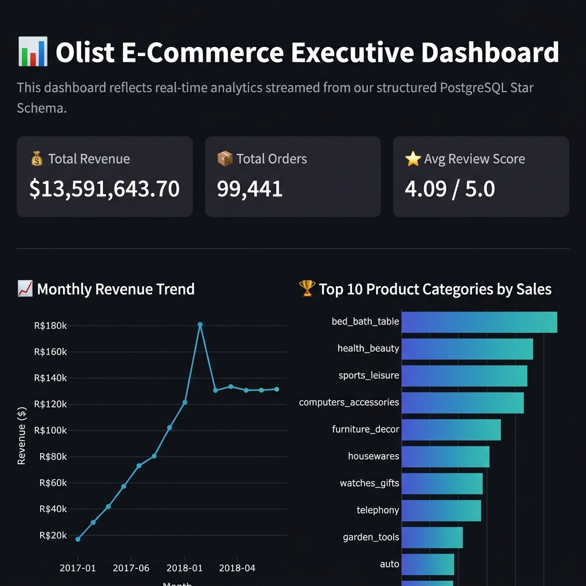

# 🛒 Olist E-Commerce ETL Pipeline & Data Warehouse

> A production-grade, end-to-end Data Engineering pipeline built on the Brazilian Olist e-commerce dataset. Extracts raw transactional CSVs, transforms them into a clean analytical Star Schema, loads them into a PostgreSQL Data Warehouse, and serves live business insights through a Streamlit + Plotly executive dashboard.

---

## 📌 Table of Contents

- [Project Overview](#-project-overview)
- [Tech Stack](#-tech-stack)
- [Architecture Diagram](#-architecture-diagram)
- [Star Schema Design](#-star-schema-design)
- [Repository Structure](#-repository-structure)
- [Dataset](#-dataset)
- [Getting Started](#-getting-started)
  - [Prerequisites](#prerequisites)
  - [1. Clone the Repository](#1-clone-the-repository)
  - [2. Create and Activate Virtual Environment](#2-create-and-activate-virtual-environment)
  - [3. Install Dependencies](#3-install-dependencies)
  - [4. Configure Environment Variables](#4-configure-environment-variables)
  - [5. Set Up PostgreSQL Database](#5-set-up-postgresql-database)
  - [6. Run the ETL Pipeline](#6-run-the-etl-pipeline)
  - [7. Launch the Dashboard](#7-launch-the-dashboard)
- [ETL Pipeline Walkthrough](#-etl-pipeline-walkthrough)
- [SQL Analysis Queries](#-sql-analysis-queries)
- [Streamlit Dashboard](#-streamlit-dashboard)
- [Data Verification](#-data-verification)
- [Troubleshooting](#-troubleshooting)
- [Project Roadmap](#-project-roadmap)

---

## 🔍 Project Overview

This project implements a full **Extract → Transform → Load (ETL)** pipeline against the [Olist Brazilian E-Commerce dataset](https://www.kaggle.com/datasets/olistbr/brazilian-ecommerce) — a real anonymized commercial dataset with ~100,000 orders placed between 2016–2018.

The raw data (9 relational CSV files) is processed into a clean analytical **Star Schema** stored in a local **PostgreSQL** data warehouse. Business analysts can then query the warehouse directly or explore insights via the live **Streamlit dashboard**.

**Key goals:**
- Demonstrate real-world data engineering patterns (modular ETL, DDL schema management, dimension/fact separation)
- Build an analytics-ready data warehouse optimized for fast aggregations
- Deliver business insights via interactive charts and KPI metrics

---

## 🛠 Tech Stack

| Layer | Technology |
|---|---|
| **Language** | Python 3.10+ |
| **Data Processing** | Pandas, NumPy |
| **Database** | PostgreSQL 18 |
| **ORM / DB Driver** | SQLAlchemy 2.x, psycopg2-binary |
| **Dashboard** | Streamlit, Plotly Express |
| **Environment** | python-dotenv, venv |
| **Testing** | pytest |
| **Notebooks** | Jupyter, ipykernel |

---

## 🏛 Architecture Diagram

```
┌─────────────────────────────────────────────────────────────────┐
│                    RAW DATA LAYER  (data/raw/)                   │
│  olist_customers.csv | olist_orders.csv | olist_order_items.csv  │
│  olist_payments.csv  | olist_reviews.csv | olist_products.csv    │
│  olist_sellers.csv   | olist_geolocation.csv | category_names.csv│
└───────────────────────────┬─────────────────────────────────────┘
                            │  src/extract/extract_data.py
                            ▼
┌─────────────────────────────────────────────────────────────────┐
│                   TRANSFORM LAYER  (src/transform/)              │
│  clean_customers.py → dim_customers DataFrame                    │
│  clean_products.py  → dim_products DataFrame                     │
│  clean_orders.py    → merged fact base (orders+items+pay+review) │
│  build_star_schema.py → generates dim_date + assembles fact_orders│
└───────────────────────────┬─────────────────────────────────────┘
                            │  src/load/load_to_postgres.py
                            ▼
┌─────────────────────────────────────────────────────────────────┐
│              POSTGRESQL DATA WAREHOUSE  (ecommerce_dw)           │
│  dim_customers | dim_products | dim_date | fact_orders           │
└───────────────┬─────────────────────────────────────────────────┘
                │  dashboard/app.py (Streamlit + Plotly)
                ▼
┌─────────────────────────────────────────────────────────────────┐
│                   EXECUTIVE DASHBOARD                            │
│  KPIs: Revenue | Orders | Avg Rating                            │
│  Charts: Monthly Revenue Trend | Top 10 Product Categories       │
└─────────────────────────────────────────────────────────────────┘
```

---

## 🌟 Star Schema Design

The warehouse uses a **Star Schema** — a single central fact table surrounded by denormalized dimension tables. This design is optimized for fast analytical `GROUP BY` and `JOIN` queries.

### `dim_customers`
| Column | Type | Description |
|---|---|---|
| `customer_id` | VARCHAR(50) PK | Unique customer identifier |
| `customer_unique_id` | VARCHAR(50) | Deduplicated customer ID |
| `customer_zip_code_prefix` | INT | Postal zone |
| `customer_city` | VARCHAR(100) | City name |
| `customer_state` | VARCHAR(10) | Brazilian state code |

### `dim_products`
| Column | Type | Description |
|---|---|---|
| `product_id` | VARCHAR(50) PK | Unique product identifier |
| `product_category` | VARCHAR(100) | English category name (translated) |
| `product_weight_g` | FLOAT | Weight in grams |
| `product_length_cm` | FLOAT | Length dimension |
| `product_height_cm` | FLOAT | Height dimension |
| `product_width_cm` | FLOAT | Width dimension |

### `dim_date`
| Column | Type | Description |
|---|---|---|
| `date_id` | INT PK | Date key in YYYYMMDD integer format |
| `full_date` | TIMESTAMP | Original purchase timestamp |
| `day` | INT | Day of month |
| `month` | INT | Month number |
| `year` | INT | Year |
| `day_of_week` | VARCHAR(20) | Named day (e.g., "Monday") |

### `dim_sellers`
| Column | Type | Description |
|---|---|---|
| `seller_id` | VARCHAR(50) PK | Unique seller identifier |
| `seller_zip_code_prefix` | INT | Postal zone |
| `seller_city` | VARCHAR(100) | Seller city name |
| `seller_state` | VARCHAR(10) | Brazilian state code |

### `fact_orders`  *(central fact table)*
| Column | Type | Description |
|---|---|---|
| `order_id` | VARCHAR(50) | Order identifier |
| `customer_id` | VARCHAR(50) FK | → dim_customers |
| `product_id` | VARCHAR(50) FK | → dim_products |
| `seller_id` | VARCHAR(50) FK | → dim_sellers |
| `date_id` | INT FK | → dim_date |
| `price` | FLOAT | Item price (BRL) |
| `freight_value` | FLOAT | Shipping cost (BRL) |
| `payment_value` | FLOAT | Total payment including all installments |
| `delivery_days` | INT | Actual delivery duration in days |
| `review_score` | FLOAT | Average customer review (1.0–5.0) |

---

## 📁 Repository Structure

```
ecommerce-etl-pipeline/
│
├── data/
│   ├── raw/                          # Raw Olist CSV files (download separately)
│   └── processed/                    # Intermediate processed outputs
│
├── src/
│   ├── config.py                     # Centralized DB config via .env
│   ├── pipeline.py                   # 🚀 Main ETL orchestrator (entry point)
│   ├── extract/
│   │   └── extract_data.py           # CSV validation & ingestion
│   ├── transform/
│   │   ├── clean_customers.py        # Customer dimension logic
│   │   ├── clean_products.py         # Product dimension + category translation
│   │   ├── clean_orders.py           # Fact base: merges items/payments/reviews
│   │   └── build_star_schema.py      # Star Schema assembly + date dim generator
│   └── load/
│       ├── db_connection.py          # SQLAlchemy engine factory
│       └── load_to_postgres.py       # DDL runner + bulk data streaming
│
├── sql/
│   ├── schema/
│   │   ├── 01_create_dimensions.sql  # Creates dim_customers, dim_products, dim_date
│   │   └── 02_create_facts.sql       # Creates fact_orders with FK references
│   ├── analysis/
│   │   ├── monthly_revenue_trend.sql # Monthly revenue + order count over time
│   │   ├── top_products_by_region.sql# Top 3 categories per Brazilian state
│   │   └── delivery_performance.sql  # Avg delivery days vs review score
│   └── verification/
│       └── row_count_checks.sql      # Quick row count validation
│
├── dashboard/
│   └── app.py                        # Streamlit + Plotly executive dashboard
│
├── notebooks/                        # Jupyter notebooks for exploration
├── tests/                            # pytest test suite
├── docs/                             # Additional documentation
│
├── .env                              # 🔒 Local secrets (not committed to git)
├── .env.example                      # Template for environment variables
├── requirements.txt                  # Python dependencies
└── README.md
```

---

## 📦 Dataset

This pipeline uses the **[Brazilian E-Commerce Public Dataset by Olist](https://www.kaggle.com/datasets/olistbr/brazilian-ecommerce)**.

**Required files** — place all in `data/raw/`:

| File | Rows | Description |
|---|---|---|
| `olist_customers_dataset.csv` | 99,441 | Customer locations |
| `olist_orders_dataset.csv` | 99,441 | Order lifecycle timestamps |
| `olist_order_items_dataset.csv` | 112,650 | Items per order + seller |
| `olist_order_payments_dataset.csv` | 103,886 | Payment method & value |
| `olist_order_reviews_dataset.csv` | 100,000+ | Customer review scores |
| `olist_products_dataset.csv` | 32,951 | Product dimensions & category |
| `olist_sellers_dataset.csv` | 3,095 | Seller locations |
| `olist_geolocation_dataset.csv` | 1,000,163 | Zip code coordinates |
| `product_category_name_translation.csv` | 71 | Portuguese → English categories |

---

## 🚀 Getting Started

### Prerequisites

- Python 3.10 or higher
- PostgreSQL 13 or higher (running locally)
- `pip` package manager

---

### 1. Clone the Repository

```bash
git clone https://github.com/YOUR_USERNAME/ecommerce-etl-pipeline.git
cd ecommerce-etl-pipeline
```

### 2. Create and Activate Virtual Environment

**Windows (PowerShell):**
```powershell
python -m venv .venv
.venv\Scripts\Activate.ps1
```

**macOS / Linux:**
```bash
python3 -m venv .venv
source .venv/bin/activate
```

### 3. Install Dependencies

```bash
pip install -r requirements.txt
```

### 4. Configure Environment Variables

Create a `.env` file in the project root:

```dotenv
DB_HOST=localhost
DB_PORT=5432
DB_NAME=ecommerce_dw
DB_USER=postgres
DB_PASSWORD=your_postgres_password_here
```

> ⚠️ Never commit `.env`. It is already in `.gitignore`.

### 5. Set Up PostgreSQL Database

```bash
psql -U postgres -c "CREATE DATABASE ecommerce_dw;"
```

> Tables are created automatically when the pipeline runs. No manual schema setup needed.

### 6. Run the ETL Pipeline

```bash
python src/pipeline.py
```

**Expected output:**
```
🏁 Initiating Production ETL Pipeline Loop...
🚀 Starting Data Extraction Phase...
✅ Successfully loaded customers. Shape: 99441 rows, 5 columns
...
🎉 Extraction Phase Completed Successfully!
⚡ Running Data Transformations...
✅ Fact Table Compiled: 112650 final rows.
📤 Initiating Target Database Load...
🔌 Database Connection Gateway Established Successfully via Config!
✅ Schema architecture successfully deployed to PostgreSQL.
📦 Target Database Loading Phase 100% Finalized!
🏆 ETL Pipeline Completed and Database populated successfully!
```

### 7. Launch the Dashboard

```bash
streamlit run dashboard/app.py
```

Open **http://localhost:8501** in your browser.

---

## 🔄 ETL Pipeline Walkthrough

### Phase 1 — Extract (`src/extract/extract_data.py`)

- Iterates over all 9 expected Olist CSV files in `data/raw/`
- Validates each file exists before loading — raises a clear `FileNotFoundError` if any are missing
- Reads each file into a `pandas.DataFrame`
- Returns a dictionary of named DataFrames

### Phase 2 — Transform (`src/transform/`)

| File | Responsibility |
|---|---|
| `clean_customers.py` | Selects customer columns, strips whitespace |
| `clean_products.py` | Merges with English category translation CSV |
| `clean_orders.py` | Casts timestamps, engineers `delivery_days`, aggregates payments and reviews, merges all into fact base |
| `build_star_schema.py` | Generates `dim_date` from purchase timestamps, maps `date_id` FK onto fact table, returns final 4-table dict |

**Key feature engineering in `clean_orders.py`:**
```python
df_orders["delivery_days"] = (
    df_orders["order_delivered_customer_date"] - df_orders["order_purchase_timestamp"]
).dt.days
```

**Date dimension generation in `build_star_schema.py`:**
```python
df_date["date_id"] = df_date["full_date"].dt.strftime("%Y%m%d").astype(int)
```

### Phase 3 — Load (`src/load/`)

1. **DDL Execution** — Runs `01_create_dimensions.sql` then `02_create_facts.sql` (in strict order to satisfy FK constraints)
2. **Dimension Streaming** — `dim_customers` → `dim_products` → `dim_date` via `DataFrame.to_sql()` with `chunksize=10000`
3. **Fact Streaming** — `fact_orders` loaded last to honour all foreign key references

---

## 📊 SQL Analysis Queries

### Monthly Revenue Trend
```sql
SELECT d.year, d.month,
    ROUND(SUM(f.payment_value)::numeric, 2) as monthly_revenue,
    COUNT(DISTINCT f.order_id) as total_orders
FROM fact_orders f
JOIN dim_date d ON f.date_id = d.date_id
GROUP BY d.year, d.month
ORDER BY d.year ASC, d.month ASC;
```

### Top 3 Product Categories per Brazilian State
```sql
WITH product_revenue AS (
    SELECT c.customer_state, p.product_category,
        ROUND(SUM(f.price)::numeric, 2) as total_sales,
        ROW_NUMBER() OVER (PARTITION BY c.customer_state ORDER BY SUM(f.price) DESC) as rank
    FROM fact_orders f
    JOIN dim_customers c ON f.customer_id = c.customer_id
    JOIN dim_products p ON f.product_id = p.product_id
    GROUP BY c.customer_state, p.product_category
)
SELECT customer_state, product_category, total_sales
FROM product_revenue WHERE rank <= 3
ORDER BY customer_state ASC, total_sales DESC;
```

### Delivery Performance vs Customer Satisfaction
```sql
SELECT p.product_category,
    ROUND(AVG(f.delivery_days)::numeric, 1) as avg_delivery_days,
    ROUND(AVG(f.review_score)::numeric, 2) as avg_review_score,
    COUNT(f.order_id) as total_items_sold
FROM fact_orders f
JOIN dim_products p ON f.product_id = p.product_id
GROUP BY p.product_category
HAVING COUNT(f.order_id) > 100
ORDER BY avg_review_score ASC;
```

---

## 📈 Streamlit Dashboard


*KPI scorecards (Total Revenue, Orders, Avg Review Score) + Monthly Revenue Trend line chart + Top 10 Product Categories bar chart — all powered live from the PostgreSQL warehouse.*

The dashboard (`dashboard/app.py`) connects directly to the `ecommerce_dw` PostgreSQL warehouse:

| Widget | Description |
|---|---|
| 💰 **Total Revenue** | Sum of all `payment_value` across `fact_orders` |
| 📦 **Total Orders** | Distinct `order_id` count |
| ⭐ **Avg Review Score** | Mean customer rating across all transactions |
| 📈 **Monthly Revenue Trend** | Line chart: revenue per month (2016–2018) |
| 🏆 **Top 10 Product Categories** | Horizontal bar chart ranked by total sales |

Data is cached for **10 minutes** via `@st.cache_data(ttl=600)` to avoid redundant DB queries on page refresh.

To run the dashboard locally:
```bash
streamlit run dashboard/app.py
# Then open: http://localhost:8501
```

---

## ✅ Data Verification

After running the pipeline, validate the load:

```sql
-- sql/verification/row_count_checks.sql
SELECT 'dim_customers' as table_name, COUNT(*) as row_count FROM dim_customers
UNION ALL SELECT 'dim_products', COUNT(*) FROM dim_products
UNION ALL SELECT 'dim_sellers',  COUNT(*) FROM dim_sellers
UNION ALL SELECT 'dim_date',     COUNT(*) FROM dim_date
UNION ALL SELECT 'fact_orders',  COUNT(*) FROM fact_orders;
```

**Expected results:**

| table_name | expected row_count |
|---|---|
| dim_customers | ~99,441 |
| dim_products | ~32,951 |
| dim_sellers | ~3,095 |
| dim_date | varies (unique timestamps) |
| fact_orders | ~112,650 |

---

## 📊 Sample Query Output

Below is a real execution snapshot from the `monthly_revenue_trend.sql` query run against the populated warehouse, confirming end-to-end pipeline success:

```sql
SELECT d.year, d.month,
    ROUND(SUM(f.payment_value)::numeric, 2) as monthly_revenue,
    COUNT(DISTINCT f.order_id) as total_orders
FROM fact_orders f
JOIN dim_date d ON f.date_id = d.date_id
GROUP BY d.year, d.month ORDER BY d.year, d.month;
```

| year | month | monthly_revenue | total_orders |
|---|---|---|---|
| 2016 | 10 | 61,236.14 | 320 |
| 2017 | 1 | 141,320.40 | 799 |
| 2017 | 6 | 536,445.02 | 3,005 |
| 2017 | 11 | 1,122,721.80 | 6,823 |
| 2018 | 1 | 1,306,014.10 | 7,244 |
| 2018 | 5 | 939,804.70 | 5,521 |

> The dataset spans **Oct 2016 → Aug 2018** with a clear growth trend peaking in early 2018. Monthly revenue grew ~21× from the first full month to peak.

---

## 🔧 Troubleshooting

### `ModuleNotFoundError: No module named 'pandas'`
Virtual environment not activated. Run:
```powershell
.venv\Scripts\Activate.ps1   # Windows
source .venv/bin/activate     # macOS/Linux
```

### `FATAL: password authentication failed for user "postgres"`
Your `.env` password does not match your PostgreSQL password. Either update `.env` to match, or reset the DB password:
```sql
ALTER USER postgres WITH PASSWORD 'your_new_password';
```

### `FileNotFoundError: Missing expected raw data file`
Download all 9 CSV files from [Kaggle](https://www.kaggle.com/datasets/olistbr/brazilian-ecommerce) and place them in `data/raw/`.

### `UnicodeEncodeError` on Windows (emoji output)
```powershell
$env:PYTHONIOENCODING="utf-8"; python src/pipeline.py
```

### PostgreSQL service not running
```powershell
# Windows PowerShell (as Administrator)
net start postgresql-x64-18
```

---

## 🧪 Testing

The project includes a pytest test suite covering all four transform layers:

```bash
# Run all tests
python -m pytest tests/ -v
```

**Current test coverage — 7 tests, all passing:**

| Test | What it validates |
|---|---|
| `test_transform_customers_cleans_messy_input` | Deduplication on `customer_id` |
| `test_transform_customers_no_duplicate_primary_keys` | Zero PK violations after transform |
| `test_transform_products_fills_missing_metrics` | `fillna(0)` on physical metric nulls |
| `test_transform_products_unknown_category_fallback` | Untranslated categories → `"unknown"` |
| `test_transform_orders_computes_delivery_days_correctly` | Feature engineering: `delivered - purchased` |
| `test_transform_orders_handles_missing_delivery_date` | Undelivered orders → `delivery_days = 0` |
| `test_transform_sellers_deduplicates_and_standardizes` | PK uniqueness + title/upper casing |

---

## 🗺 Project Roadmap

- [x] Modular ETL pipeline with phase separation
- [x] PostgreSQL Star Schema data warehouse (5 tables)
- [x] Automated DDL schema management
- [x] Bulk streaming with chunked inserts
- [x] Streamlit + Plotly executive dashboard
- [x] SQL analysis query library
- [x] `dim_sellers` dimension — complete star schema with all FK references
- [x] pytest unit tests for all transform functions (7 tests)
- [ ] Data quality checks (null rates, duplicate detection)
- [ ] Schedule pipeline with Apache Airflow or cron
- [ ] Deploy dashboard to Streamlit Cloud
- [ ] Add `dim_geolocation` dimension
- [ ] Dockerize the full pipeline + database

---

## 📄 License

This project is open-source and available under the [MIT License](LICENSE).

---

## 🙏 Acknowledgements

- [Olist](https://olist.com/) for providing the anonymized e-commerce dataset
- [Kaggle](https://www.kaggle.com/datasets/olistbr/brazilian-ecommerce) for hosting the dataset

---

*Built with Python, PostgreSQL, Pandas, SQLAlchemy, Streamlit, and Plotly.*
